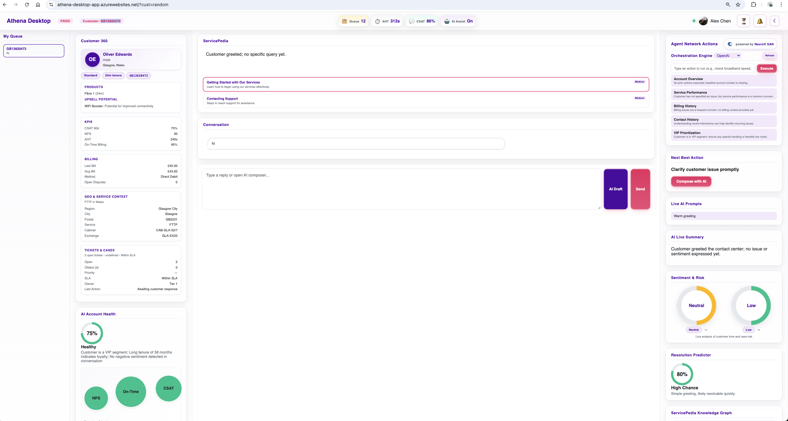
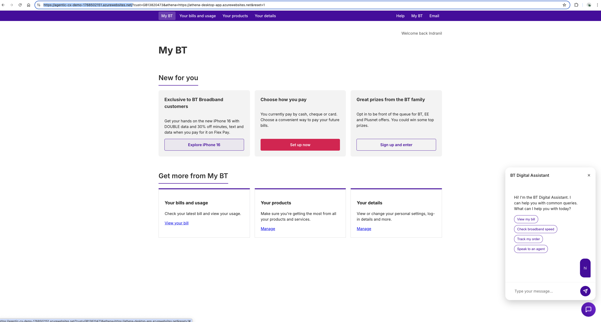
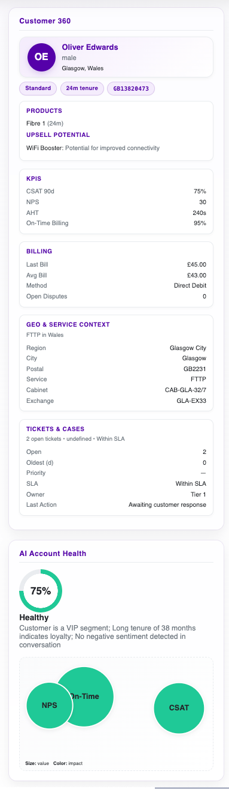
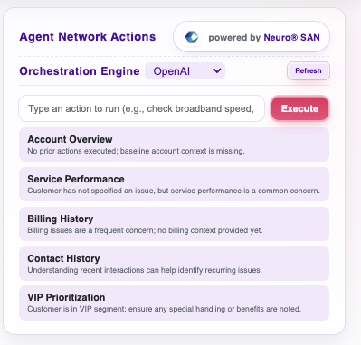
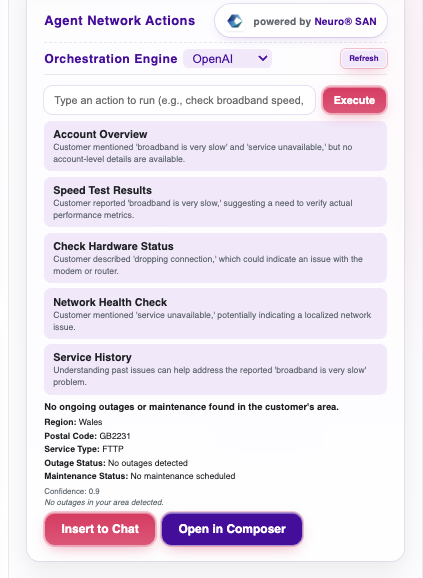
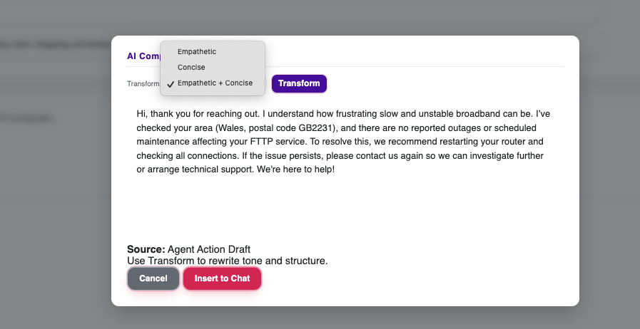

# Athena Agentic Unified Desktop — Demo Script (Marketing)

<strong>Audience promise:</strong> Watch how Athena + Neuro SAN turns a messy, live customer issue into a confident, guided resolution—<strong>plan → execute → explain → respond</strong>—in real time.

  
<strong>Table of contents</strong>

  <ul>
    <li><a href="#demo-control-panel">Demo control panel (copy/paste links)</a></li>
    <li><a href="#runbook">Setup & run (local + Azure)</a></li>
    <li><a href="#screens">Screenshots (click to zoom)</a></li>
    <li><a href="#operator">Operator notes (repeatable demos)</a></li>
    <li><a href="#flow">Live demo flow (8–10 minutes)</a></li>
    <li><a href="#fallbacks">Backup scenarios</a></li>
  </ul>

## Demo control panel (copy/paste links)

<strong>Set these three values once per demo:</strong>

<ul>
  <li><strong>Customer ID</strong> (use the same everywhere): <code>GB13820473</code> (or any from your pool)</li>
  <li><strong>Athena base URL</strong>: <code>http://localhost:3001</code> (local) or <code>https://&lt;athena-app&gt;.azurewebsites.net</code> (Azure)</li>
  <li><strong>CX Demo base URL</strong>: <code>http://localhost:4002</code> (local) or <code>https://&lt;cx-app&gt;.azurewebsites.net</code> (Azure)</li>
</ul>

<strong>Open these two tabs:</strong>

<ol>
  <li><strong>Athena (agent view):</strong> 
    <code>&lt;ATHENA_BASE_URL&gt;/?cust=&lt;CUSTOMER_ID&gt;</code>
  </li>
  <li><strong>CX Demo (customer view, clean start):</strong> 
    <code>&lt;CX_BASE_URL&gt;/?cust=&lt;CUSTOMER_ID&gt;&amp;athena=&lt;ATHENA_BASE_URL&gt;&amp;reset=1</code>
  </li>
</ol>

<blockquote>
  
<strong>Why <code>reset=1</code> matters:</strong> Athena stores demo chat state in memory keyed by customer ID. A page refresh does not clear it. Reset gives you a clean, scripted run every time.

</blockquote>

---

## Setup & run (local + Azure)

  
<strong>Local runbook (recommended for rehearsals)</strong>

  <h3>1) Start Athena (Agentic Unified Desktop)</h3>
  <ul>
    <li><code>cd athena-agentic-unified-desktop</code></li>
    <li><code>npm install</code></li>
    <li><code>npm start</code></li>
    <li>Open: <code>http://localhost:3001/?cust=GB13820473</code></li>
  </ul>

  <h3>2) Start CX Demo (Customer UI)</h3>
  <ul>
    <li><code>cd agentic-cx-demo/server</code></li>
    <li><code>npm install</code></li>
    <li><code>npm start</code></li>
    <li>Open (clean demo start): <code>http://localhost:4002/?cust=GB13820473&amp;athena=http://localhost:3001&amp;reset=1</code></li>
  </ul>

  
<strong>Azure runbook (on-stage / shared demos)</strong>

  
<strong>Example URLs</strong> (replace with your deployed app names):

  <ul>
    <li>Athena: <code>https://&lt;athena-app&gt;.azurewebsites.net</code></li>
    <li>CX Demo: <code>https://&lt;cx-app&gt;.azurewebsites.net</code></li>
  </ul>

  
<strong>Open these:</strong>

  <ol>
    <li>Athena: <code>https://&lt;athena-app&gt;.azurewebsites.net/?cust=GB13820473</code></li>
    <li>CX Demo (clean start): <code>https://&lt;cx-app&gt;.azurewebsites.net/?cust=GB13820473&amp;athena=https://&lt;athena-app&gt;.azurewebsites.net&amp;reset=1</code></li>
  </ol>

---

## Screenshots (click to zoom)

Drop images into <code>docs/screenshots/</code>. GitHub will render thumbnails and you can click to zoom.

<table>
  <tr>
    <td align="center">
       
      <strong>01</strong> Athena overview
    </td>
    <td align="center">
       
      <strong>02</strong> CX Demo chat open
    </td>
  </tr>
  <tr>
    <td align="center">
       
      <strong>03</strong> Customer 360 updates
    </td>
    <td align="center">
       
      <strong>04</strong> Neuro SAN action choreography
    </td>
  </tr>
  <tr>
    <td align="center">
       
      <strong>05</strong> Execute action + findings
    </td>
    <td align="center">
       
      <strong>06</strong> Customer-ready response lands live
    </td>
  </tr>
</table>

<blockquote>
  
<strong>Tip:</strong> If you don’t have screenshots yet, capture them in this order so the script matches the visuals. See <code>docs/screenshots/README.md</code> for suggested filenames.

</blockquote>

---

## Operator notes (repeatable demos)

### Identity sync (Athena + CX Demo)
- The demo’s “customer” is defined by the `cust` URL param.
- CX Demo uses the same `cust` to:
  - forward customer messages to Athena (`/api/v1/external-chat`)
  - subscribe to Athena’s SSE stream (`/api/v1/stream/customer-360/:cust`)

<strong>Non‑negotiable rule:</strong> Use the <em>same explicit</em> <code>cust</code> value in both tabs.

### Clean starts (avoid unscripted flows)
- Always use `reset=1` on CX Demo.
- Mid-demo reset: reload the CX Demo URL with `reset=1`.

### Narration anchors (the four “wow pillars”)
- <strong>Real-time streaming (SSE):</strong> “updates arrive live—no polling.”
- <strong>Neuro SAN orchestration:</strong> “specialist agents coordinated—not a single prompt.”
- <strong>Structured actions:</strong> “plan, validate, execute—traceable and consistent.”
- <strong>Customer-ready responses:</strong> “clear, empathetic messages drafted instantly.”

---

## Live demo flow (8–10 minutes)

  
<strong>Pre-flight checklist (30 seconds)</strong>

  - [ ] Athena tab open: `...?cust=GB13820473`
  - [ ] CX Demo tab open (clean): `...?cust=GB13820473&athena=...&reset=1`
  - [ ] Send “hello” from CX Demo
  - [ ] Verify Athena updates + CX Demo receives streamed response

  
<strong>Talk track: Opening (30 seconds)</strong>

  - “Athena is a real-time, agent-first workspace that turns live conversations into decisive guidance.”
  - “Powered by Neuro SAN—Cognizant’s multi-agent orchestrator—it choreographs agent actions end-to-end: plan → execute → explain → respond.”

### Step 1 — Set the scene (30–45 seconds)

<strong>Show:</strong> Athena (agent view) + CX Demo (customer view).

  
<strong>What to say</strong>

  “On the right is the customer. On the left is the agent workspace. As the conversation unfolds, Athena continuously streams Customer 360 context, risk signals, next-best actions, and response drafts.”

### Step 2 — Start the customer issue (60–90 seconds)

<strong>Customer message (paste into CX Demo):</strong>

<blockquote>
  My broadband drops every evening. I’ve rebooted twice and it’s still happening. I work from home—please fix this.
</blockquote>

  
<strong>What to call out on screen</strong>

  <ul>
    <li>Customer 360 updates (context, service, signals)</li>
    <li>Mini insights / summary and any risk/health indicators</li>
    <li>Draft response or next-best action starting to form</li>
  </ul>

### Step 3 — The ‘wow’ moment: Neuro SAN action choreography (2 minutes)

<strong>Action:</strong> Open <strong>Agent Network Actions</strong> in Athena.

  
<strong>What to say</strong>

  <ul>
    <li>“This isn’t just a suggestion list—Neuro SAN orchestrates a sequence of specialist actions.”</li>
    <li>“Each action is structured and traceable, with rationale and intent.”</li>
  </ul>

### Step 4 — Execute an action live (2 minutes)

<strong>Pick one action</strong> that matches your story (e.g., outage/maintenance check, stability diagnostics, recent case/SLA review).

  
<strong>What to say</strong>

  “I’m executing this action now. Neuro SAN coordinates the right specialist agent, validates the best path, and returns structured findings we can trust—fast.”

  
<strong>What to call out on screen</strong>

  <ul>
    <li>Concise summary + structured findings</li>
    <li>Clear next step (what the agent should do next)</li>
    <li>Consistency: repeatable reasoning, not ad-hoc guesswork</li>
  </ul>

### Step 5 — Explain + respond (90 seconds)

<strong>Action:</strong> Send the drafted customer-ready response from Athena.

  
<strong>What to say</strong>

  “Athena translates internal findings into a calm, customer-ready message—what we found, what we’re doing, and what the customer can try next—without exposing internal tool noise.”

### Step 6 — Real-time sync (45–60 seconds)

<strong>Show:</strong> CX Demo receiving the response live (SSE).

  
<strong>What to say</strong>

  “This is real-time streaming: the customer experience updates instantly—no refresh, no copy/paste.”

### Step 7 — Close (30–45 seconds)

  
<strong>Closing lines</strong>

  <ul>
    <li>“Athena reduces handle time, improves consistency, and keeps agents confident under pressure.”</li>
    <li>“Powered by Neuro SAN, it turns a conversation into a guided journey—plan → execute → explain → respond—at conversation speed.”</li>
  </ul>

---

## Backup scenarios

  
<strong>Scenario A — De-escalation / retention risk</strong>

  
<strong>Customer message:</strong>

  <blockquote>This is the third time. I’m ready to cancel.</blockquote>

  
<strong>Angle:</strong> Highlight risk signals + retention-safe next best action + empathic response draft.

  
<strong>Scenario B — Billing shock</strong>

  
<strong>Customer message:</strong>

  <blockquote>My bill jumped this month and I don’t understand why.</blockquote>

  
<strong>Angle:</strong> Highlight Customer 360 billing context + clear explanation + next steps.

